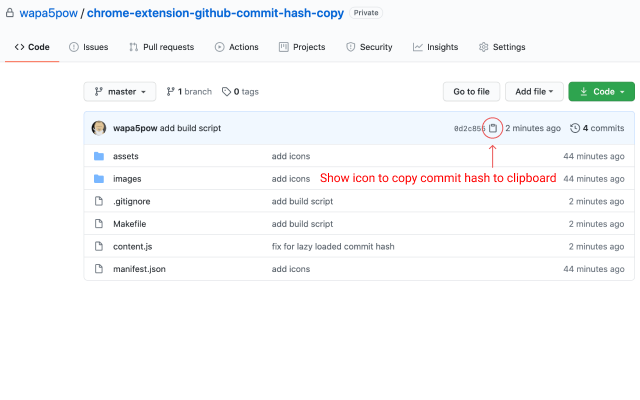

# Chrome Extension GitHub Commit Hash Copy

## Install

## From Chrome Web Store

[GitHub commit hash copy | Chrome Web Store](https://chrome.google.com/webstore/detail/github-commit-hash-copy/jgjckcfnlhhpnlccmagaifpkbomomgko?hl=en&authuser=0)

## From source code

1. Donwload source code.
2. Open [chrome://extensions/](chrome://extensions/) on Chrome browser.
3. Enable "Developer mode" on top right corner.
4. Click "Load unpacked" button and direct it to the root of the source code.
5. Go to any github repository to see clipboard icon is on next to commit hash.